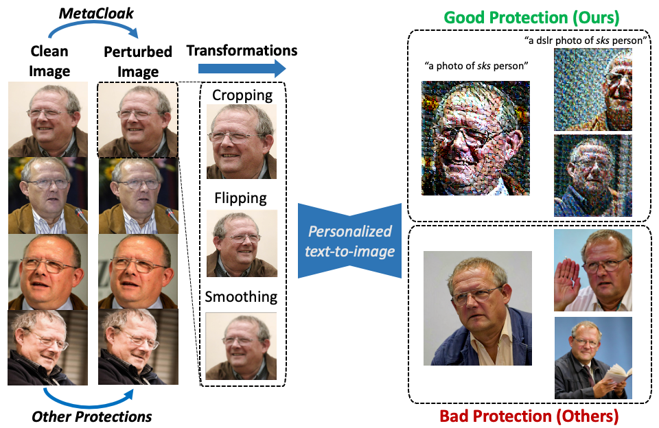
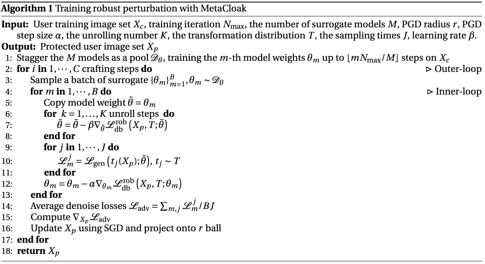

# 🎭 Metacloak: Preventing Unauthorized Subject-driven Text-to-image Diffusion-based Synthesis via Meta-learning
> Robust Imperceptible Perturbation against Diffusion Models;

> This is the official implementation of the paper "Metacloak: Preventing Unauthorized Subject-driven Text-to-image Diffusion-based Synthesis via Meta-learning" (CVPR 2024). [📄Paper](https://arxiv.org/abs/2311.13127); [🏠Homepage](https://metacloak.github.io); [🤗Huggingface Dataset](https://huggingface.co/datasets/yixin/metacloak_celeba_vggface2); 
<!-- The complete code and data will be released upon acceptance. Four sampled IDs from VGGFace2 (clean and protected images with our method with $r=11/255$) are released under the `./example_data/` folder. Free feel to test out the protection performance.  -->
<div align="center">
    
</div>

<!-- ## Algorithm Flow

 -->


## Software Dependencies
```shell
conda create -n metacloak python=3.9.18
# please choose pip or conda to install pytorch and cuda tool kit
# pip install torch==1.13.1+cu116 torchvision==0.14.1+cu116 torchaudio==0.13.1 --extra-index-url https://download.pytorch.org/whl/cu116
conda install pytorch==1.13.1 torchvision==0.14.1 torchaudio==0.13.1 pytorch-cuda=11.6 -c pytorch -c nvidia
pip install -r requirement.txt --ignore-installed
pip install ftfy regex tqdm git+https://github.com/openai/CLIP.git
pip install git+https://github.com/huggingface/diffusers.git
pip install git+https://github.com/TimDettmers/bitsandbytes.git
```

## Data and Checkpoint Dependencies
- put LIQE checkpoint `https://drive.google.com/file/d/1GoKwUKNR-rvX11QbKRN8MuBZw2hXKHGh/view` to `./LIQE/checkpoints/`
- dataset 
    - download CelebA+VGGFace2 `https://drive.google.com/file/d/1RrlGMOuA2WF5RrWiLSt3QPxFNd3EagvG/view?usp=sharing` put them into `./dataset/`
- model: download sd models into `./SD/` folder
    - 2.1base https://huggingface.co/stabilityai/stable-diffusion-2-1-base


## Environment Setup
setup the following environment variables 
```shell
# your project root
export ADB_PROJECT_ROOT="/path/to/your/project/root"
# your conda env name
export PYTHONPATH=$PYTHONPATH$:$ADB_PROJECT_ROOT
```

## Scripts 
### File Structure
```shell
- script
    -- sub
        --- generic.sh # this is for evaluation of the generated perturbation
    -- gen 
        --- generic.sh # some generic config for perturbation generation
        --- Clean.sh # no perturb 
        --- metacloak.sh # metacloak perturbation
    -- gen_and_eval.sh # generate and evaluate perturbation
    -- methods_config.sh # hyper-parameter config of diff. methods  
```

### Perturbation Generation and Evaluation
```shell
# please modify some config in the script before running
bash ./scripts/gen_and_eval.sh
# Then foor loop all the instances and compute the metrics 
```


## Citation
If our work or codebase is useful for your research, please consider citing:
```bibtex
@article{liu2023toward,
  title={Toward Robust Imperceptible Perturbation against Unauthorized Text-to-image Diffusion-based Synthesis},
  author={Liu, Yixin and Fan, Chenrui and Dai, Yutong and Chen, Xun and Zhou, Pan and Sun, Lichao},
  journal={arXiv preprint arXiv:2311.13127},
  year={2023}
}
```


## Acknowledgement
- [Anti-Dreambooth](https://github.com/VinAIResearch/Anti-DreamBooth)
- [CLIP-IQA](https://github.com/IceClear/CLIP-IQA?tab=readme-ov-file)
- [deepface](https://github.com/serengil/deepface)
- [REM](https://github.com/fshp971/robust-unlearnable-examples)
